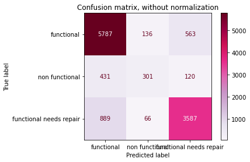
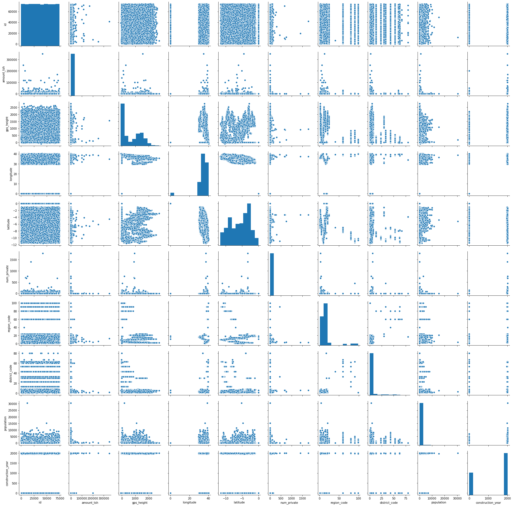
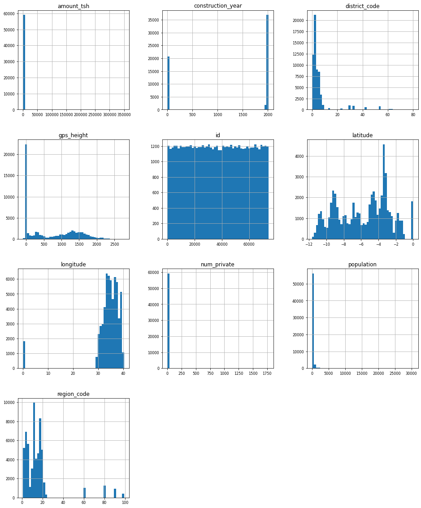
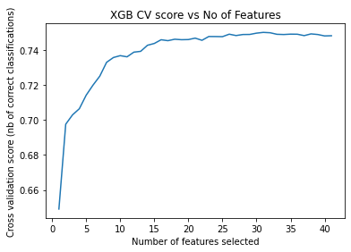
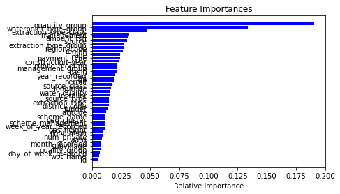

# Pump-it-Up-Data-Mining-the-Water-Table-Challenge

Initial solution for the challenge. Current output file does not conform to the requested format for the .csv.
Prediction value on test set: 0.814

 
 
 
 
 
Challenge link: https://www.drivendata.org/competitions/7/pump-it-up-data-mining-the-water-table/page/25/
